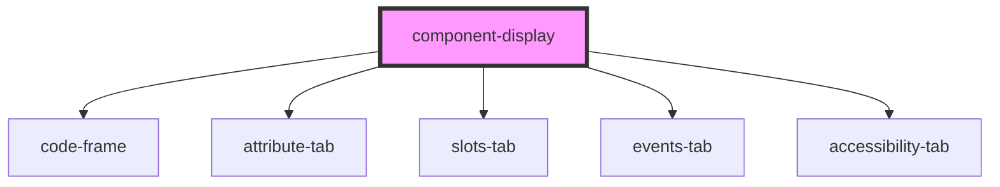

# element-display

<!-- Auto Generated Below -->

## Properties

| Property          | Attribute          | Description | Type                                      | Default     |
| ----------------- | ------------------ | ----------- | ----------------------------------------- | ----------- |
| `accessibility`   | `accessibility`    |             | `boolean`                                 | `false`     |
| `attrs`           | `attrs`            |             | `AttributesType[] \| string`              | `undefined` |
| `events`          | `events`           |             | `EventType[] \| string`                   | `undefined` |
| `framework`       | `framework`        |             | `"angular" \| "html" \| "react" \| "vue"` | `'html'`    |
| `landmarkDisplay` | `landmark-display` |             | `boolean`                                 | `false`     |
| `slots`           | `slots`            |             | `SlotType[] \| string`                    | `undefined` |

## Dependencies

### Depends on

- [code-frame](../code-frame)
- [attribute-tab](../attribute-tab)
- [slots-tab](../slots-tab)
- [events-tab](../events-tab)
- [accessibility-tab](../accessibility-tab)

### Graph

----------------------------------------------

*Built with [StencilJS](https://stenciljs.com/)*
