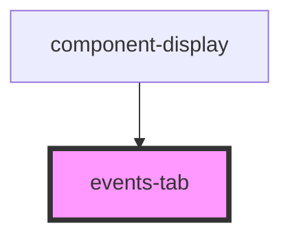

# events-tab

<!-- Auto Generated Below -->

## Properties

| Property      | Attribute      | Description | Type          | Default     |
| ------------- | -------------- | ----------- | ------------- | ----------- |
| `eventObject` | `event-object` |             | `EventType[]` | `undefined` |

## Dependencies

### Used by

 - [component-display](../component-display)

### Graph

----------------------------------------------

*Built with [StencilJS](https://stenciljs.com/)*
