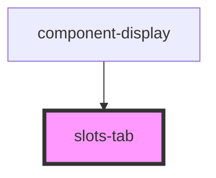

# slots-tab

<!-- Auto Generated Below -->

## Properties

| Property                      | Attribute         | Description | Type         | Default     |
| ----------------------------- | ----------------- | ----------- | ------------ | ----------- |
| `displayElement` _(required)_ | `display-element` |             | `Element`    | `undefined` |
| `slotHistory`                 | `slot-history`    |             | `Object`     | `undefined` |
| `slotObject`                  | `slot-object`     |             | `SlotType[]` | `undefined` |

## Events

| Event             | Description | Type                  |
| ----------------- | ----------- | --------------------- |
| `slotValueChange` |             | `CustomEvent<Object>` |
| `statusUpdate`    |             | `CustomEvent<Object>` |

## Dependencies

### Used by

 - [component-display](../component-display)

### Graph

----------------------------------------------

*Built with [StencilJS](https://stenciljs.com/)*
